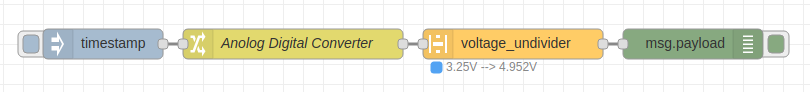

node-red-contrib-voltage_undivider
==================================


<a href="http://nodered.org" target="_new">Node-RED</a> A Node to un-divide a voltage that was divided prior to taking a reading to protect a input when reading its value.

---

## Table of Contents
* [Install](#install)
* [Usage](#usage)
  * [Voltage_In](#Voltage_In)
  * [Resistor_1](#Resistor_1)
  * [Resistor_2](#Resistor_2)
  * [Voltage_Out](#Voltage_Out)
  * [Round_Output](#Round_Output)
* [Example Flows](#example-flows)
  * [Example](#example)
* [Bugs / Feature request](#bugs--feature-request)
* [License](#license)
* [Work](#work)
* [Contributor of Project](#contributor)

---

## Install

Install with node-red Palette Manager or,

Run the following command in your Node-RED user directory - typically `~/.node-red`:

```
npm install node-red-voltage_undivider
```


## Usage

A Node to un-divide a voltage that was divided prior to taking a reading to protect a input when reading its value.
Just insert the node in between two others. Then the voltage received can be corrected, undivided, to show voltage before the physical voltage devider.

Be sure to send the voltage as msg.payload. After the voltage_undivider does its work the output will also be sent via msg.payload


### Voltage_In

Select the voltage scale for the Input. Voltages from diffrent sources may be represented in diffrent scales. Example; a ADC (Anolog to Digital Converter may output in mV. You must select the correct input voltage scale or your output will be wrong.

### Resistor_1


Select the resistor scale for the resistor used. Then enter the resistance.

### Resistor_2


Select the resistor scale for the resistor used. Then enter the resistance.

### Voltage_Out

Select the voltage scale you want for the Output. If you have selected the correct scale on the input the output scale you have selected will be automaticly converted to the voltage you want.

### Round_Output

If you would like your output to be rounded then select the level you want. Note: if you choose not to round the maximum integer length is 15 digits. The maximum length after a decimals is 17 digits. 

## Example Flows

Simple examples showing how to use the voltage_undivider.


### Example



```JSON
[{"id":"b0b8b22c.dd0f6","type":"inject","z":"99d92ba1.9f3598","name":"","topic":"","payload":"","payloadType":"date","repeat":"","crontab":"","once":false,"onceDelay":0.1,"x":140,"y":160,"wires":[["2dbeb200.2d534e"]]},{"id":"d9a532a2.d8d81","type":"debug","z":"99d92ba1.9f3598","name":"","active":true,"tosidebar":true,"console":false,"tostatus":false,"complete":"payload","x":470,"y":160,"wires":[]},{"id":"2dbeb200.2d534e","type":"timeframerlt","z":"99d92ba1.9f3598","name":"","throttleType":"count","timeLimit":"2","timeLimitType":"seconds","countLimit":"4","byresetcountLimit":"4","x":310,"y":160,"wires":[["d9a532a2.d8d81"]]}]
```

## Bugs / Feature request
Please [report](https://github.com/meeki007/node-red-contrib-voltage_undivider/issues) bugs and feel free to [ask](https://github.com/meeki007/node-red-contrib-voltage_undivider/issues) for new features directly on GitHub.


## License
This project is licensed under [Apache 2.0](http://www.apache.org/licenses/LICENSE-2.0) license.


## Work
_Need a node?
_Need automation work?
_Need computers to flip switches?
  
Contact me at meeki007@gmail.com


## Contributor of Project

Thanks to [SunValleyFoods](https://www.sunvalleyfoods.com/) for being a buisness that supports opensource. They needed this node for a monitoring and automation project for their equipment.

## release notes ##
0.0.0 = (majorchange) . (new_feature) . (bugfix-simple_mod)

version 0.7.6
First Public release


